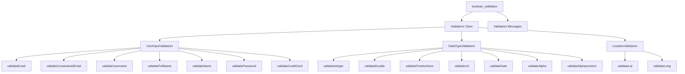
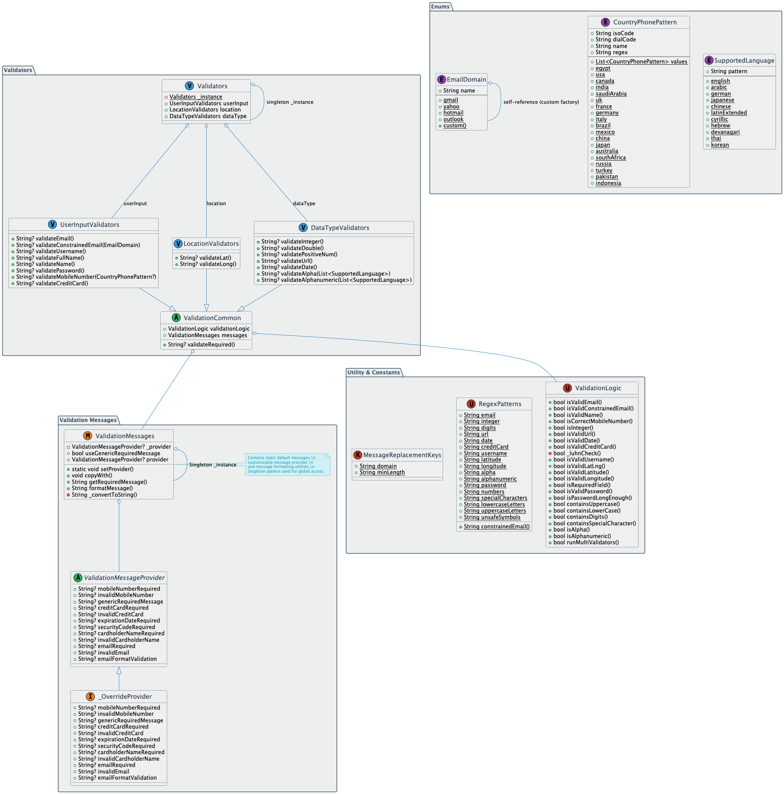

# Boolean Validation

I basically build this Package so Devs can use

1. A complete set of regex patterns for common validation needs.
2. Handy shorthand methods to simplify built-in `TextFormField` validation.
3. `isValid` methods for easy `bool` checks in any context.
4. Built-in validation messages with override and localization support.
5. Customizable "required" messages globally or per field type.
6. Field-specific messages that override the default ones when needed.
7. Support for validating email addresses with specific domain rules.
8. Phone number validation tailored for 19 supported countries.
9. Validate alphabetic characters for 10 languages, allowing checks against one or multiple selected
   languages (e.g., English and Arabic).

## Table of Contents

- [Some Visual References](#some-visual-references)
    - [Overview Graph](#overview-graph)
    - [Full Detailed Graph](#fully-detailed)
- [Get Ready](#get-ready)
- [Available Validators](#available-validators)
    - [User Input Validators](#User-Input-Validators)
    - [Data Type Validators](#Data-Type-validators)
- [Some Complex Examples](#some-complex-examples)
    - [Email Constrained Domain Validation](#email-constrained-domain-validation)
    - [Mobile Number Validation](#mobile-number-validation)
    - [Password Validation](#password-validation)
    - [Name Validation](#name-validation)
    - [Run Many Validation Logic](#run-many-validation-logic)
- [Contributing](#contributing)
- [License](#license)

## Some Visual References

### Overview Graph



### Fully Detailed:



## Get Ready

Add to your `pubspec.yaml`:

```yaml
dependencies:
  boolean_validation: ^1.0.0
```

Basic usage:

```dart
import 'package:boolean_validation/boolean_validation.dart';

final validators = Validators();

// Validate email
TextFormField(
    controller: TextEditingController(),
    decoration: InputDecoration(
        labelText: 'Email',
        border: OutlineInputBorder(),
      ),
    keyboardType: TextInputType.emailAddress,
    validator: (value) =>
        _validators.userInput.validateEmail(value,
            // in case of using arb as localization
            customRequiredMessage: l10n.emailRequired,
            customInvalidMessage:l10n.invalidEmail,
           ),
    ),
```

## Available Validators

### User Input Validators

| Validator                  | Description                                                                            | Example                                                                                                                                                                                |
|----------------------------|----------------------------------------------------------------------------------------|----------------------------------------------------------------------------------------------------------------------------------------------------------------------------------------|
| `validateEmail`            | Email format                                                                           | `validateEmail('test@example.com')`                                                                                                                                                    |
| `validateConstrainedEmail` | Email format depending on specific domain validation                                   | `validateConstrainedEmail('test@2math.op', domain: EmailDomain.custom('2math.op')`                                                                                                     |
| `validateMobileNumber`     | Mobile number validation depending on country (iso or code)                            | `validateMobileNumber('1201234567', prefix: CountryPhonePattern.egypt.dialCode)`                                                                                                       |
| `validateCreditCard`       | Credit card validation                                                                 | • Luhn algorithm<br>• Card type detection<br>• Format validation                                                                                                                       |
| `validatePassword`         | Password strength validation  includes all characters, you can change that if you need | • Length requirements<br>• Character type requirements<br>• Complexity rules                                                                                                           |
| `validateUsername`         | Username format validation                                                             | • Length requirements<br>• Character restrictions<br>• Format validation                                                                                                               |
| `validateFullName`         | at least first and last names                                                          | • Words Count requirements<br>• Alpha **Language** Characters' restrictions<br>• Format validation                                                                                     |
| `validateName`             | it must be a legit name                                                                | ```validateName(isRequired = true, customRequiredMessage = "required Name",customInvalidMessage= "Invalid Name", multiLang = [SupportedLanguage.arabic,SupportedLanguage.english,]}``` |

### Data Type Validators

| Validator              | Description                            | Features                             |
|------------------------|----------------------------------------|--------------------------------------|
| `validateUrl`          | URL format validation                  | `validateUrl('https://example.com')` |
| `validateDate`         | Date format validation (YYYY-MM-DD)    | `validateDate('2020-4-20')`          |
| `validateInteger`      | validate on Integer Numbers            | `validateInteger(123)`               |
| `validateDouble`       | validate on Double (Decimal) Numbers   | `validateDouble(3.47)`               |
| `validatePositiveNum`  | validate on Positive Numbers           | `validatePositiveNum(12)`            |
| `validateAlpha`        | validate on Alpha characters (letters) | `validateAlpha("Thomas")`            |
| `validateAlphanumeric` | validate on characters with numbers    | `validateAlphanumeric(2Math)`        |

## Some Complex Examples

### Email Constrained Domain Validation

```dart
  String? validateConstrainedEmail(String? value, {
  required EmailDomain domain,
  bool isRequired = true,
  String? customRequiredMessage,
  String? customInvalidMessage,
});
```

| Parameter               | Type      | Description          |
|-------------------------|-----------|----------------------|
| `value`                 | `String?` | Email to validate    |
| `customRequiredMessage` | `String?` | Message when empty   |
| `customInvalidMessage`  | `String?` | Message when invalid |
| `domain`                | `String?` | Required domain      |

---

### Mobile Number Validation

```dart
String? validateMobileNumber(String? value,
    {
      bool isRequired = true,
      String? customRequiredMessage,
      String? customInvalidMessage,
      String? prefix,
    });
```

| Parameter               | Type      | Description                                              |
|-------------------------|-----------|----------------------------------------------------------|
| `value`                 | `String?` | Mobile number to validate                                |
| `customRequiredMessage` | `String?` | Message when empty                                       |
| `customInvalidMessage`  | `String?` | Message when invalid                                     |
| `prefix`                | `String?` | Country code to validate from `CountryPhonePattern` enum |

---

### Password Validation

```dart
 String? validatePassword(String? value, {
  int minLength = 8,
  bool requireUppercase = true,
  String? customUppercaseMessage,
  bool requireDigit = true,
  String? customDigitMessage,
  bool requireSpecialChar = true,
  String? customSpecialCharMessage,
});
```

| Parameter              | Type      | Default | Description                                                   |
|------------------------|-----------|---------|---------------------------------------------------------------|
| `value`                | `String?` | -       | Password to validate                                          |
| `minLength`            | `int`     | 8       | Minimum length                                                |
| `requireUppercase`     | `bool`    | true    | Require uppercase                                             |
| `requireLowercase`     | `bool`    | true    | Require lowercase                                             |
| `requireDigit`         | `bool`    | true    | Require digit                                                 |
| `requireSpecialChar`   | `bool`    | true    | Require special char                                          |
| `custom Message *args` | `String?` | -       | give a message if the validation fail on any of required ones |

---

### Name Validation

```dart
String? validateName(String? value, {
  bool isRequired = true,
  String? customRequiredMessage,
  String? customInvalidMessage,
  List<SupportedLanguage> multiLang = const [SupportedLanguage.english],
});
```

| Parameter               | Type                      | Default                         | Description                                         |
|-------------------------|---------------------------|---------------------------------|-----------------------------------------------------|
| `value`                 | `String?`                 | –                               | The name input to validate.                         |
| `isRequired`            | `bool`                    | `true`                          | Whether the name field is required.                 |
| `customRequiredMessage` | `String?`                 | `messages.nameRequired`         | Custom error message if the field is empty.         |
| `customInvalidMessage`  | `String?`                 | `messages.nameMustBeAlphabetic` | Custom error message for invalid characters.        |
| `multiLang`             | `List<SupportedLanguage>` | `[SupportedLanguage.english]`   | List of allowed languages for character validation. |

---

### Run Many Validation Logic

```dart
bool runMultiValidators({
  required List<bool Function()> validators,
});
```

| Parameter    | Type                    | Default | Description                |
|--------------|-------------------------|---------|----------------------------|
| `validators` | `List<bool Function()>` | –       | List of boolean validators |

#### Example
```dart
class ShowCaseForMixinValidator extends StatefulWidget {
  const ShowCaseForMixinValidator({super.key});

  @override
  State<ShowCaseForMixinValidator> createState() =>
          _ShowCaseForMixinValidatorState();
}
```
> Notice the use of Mixin `ValidationLogic` with the `with` keyword to access all the methods directly
```dart
class _ShowCaseForMixinValidatorState extends State<ShowCaseForMixinValidator>
        with ValidationLogic {
  @override
  void initState() {
    super.initState();
    var result = runMultiValidators(validators: [
      isInteger('4'),
      isPositiveNum('4'),
    ]);
    debugPrint("output result is $result");
    // output result is true
  }

  @override
  Widget build(BuildContext context) {
    return const Placeholder();
  }
}
```

---

## Contributing

Contributions are welcome! Please feel free to submit a Pull Request.

## License

This project is licensed under the MIT License - see the [LICENSE](LICENSE) file for details.

